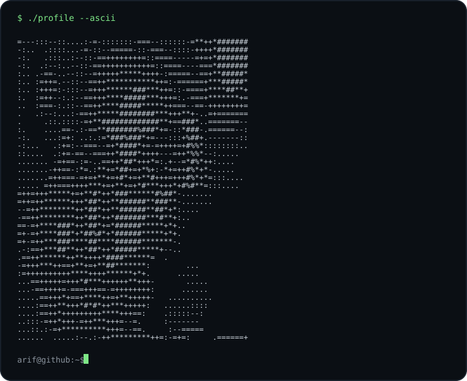
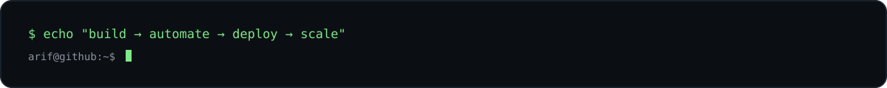

Arif Sadik · arif@github

  

  <b>CS Student · Full-Stack Developer · Automation & Robotics</b> 
  Building software today · learning to deploy, automate & scale tomorrow

  
  
  

~/about

  

$ whoami
arif sadik

$ role
cs student · full-stack developer · builder

$ focus
web systems · automation · robotics

$ next
devops / cloud engineering

$ uptime
learning continuously.

I'm Md. Arif Sadik Molla, a Computer Science student at MIST who enjoys turning ideas into working software.

My current work sits around full-stack web development, automation, robotics, and practical systems. I'm gradually moving deeper into Linux, cloud infrastructure, CI/CD, containers, and DevOps — with the goal of becoming an engineer who can not only build software, but also ship and operate it reliably.

I like projects that make me learn something underneath the abstraction: databases, networking, application architecture, automation, and the systems that keep software running.

~/stack

Languages

TypeScript · JavaScript · Python · C++ · Java · Shell

Frontend

React · Next.js · HTML · CSS · Tailwind CSS · SVG

Backend & Data

Node.js · Express.js · MongoDB · Mongoose · Oracle · SQLite

Engineering

Git · GitHub · Linux · REST APIs · Database Design · AI-assisted development

Exploring

Docker · CI/CD · Cloud · DevOps · Infrastructure

  

~/projects

01 · GuardianLink

JavaFX-based NGO Management System

A role-based desktop application designed to streamline NGO operations around children, caregivers, donors and administration.

Built with: Java 21 · JavaFX · SQLite · JDBC · Maven

Highlights include role-based access, child/caregiver management, donor and sponsorship workflows, real-time in-app notifications, and persistent local database storage.

→ View repository

02 · PitchSync

Cricket administration & integrity management platform

An academic DBMS project focused on managing players, teams, tournaments, match performance, fitness records, complaints, investigations and disciplinary cases.

The current repository contains a working Next.js frontend, with an Express/Node backend and Oracle database development structure prepared for integration.

Built with: Next.js · React · TypeScript · Tailwind CSS · Express · Node.js · Oracle

→ View repository

03 · AyahTrack

Offline-first Quran & Salah tracking application

A privacy-focused Flutter application for building consistency in Quran recitation and daily Salah. It includes ayah-level progress tracking, prayer logging, analytics, a 365-day activity heatmap, local storage, and JSON backup/restore.

Built with: Flutter · Dart · Provider · SQLite · SharedPreferences

→ View repository

~/currently

[██████████████████░░] full-stack engineering
[██████████████░░░░░░] systems & automation
[████████████░░░░░░░░] robotics
[█████████░░░░░░░░░░░] cloud / devops

Currently going deeper into:

Linux & system fundamentals

Docker & containerized applications

CI/CD pipelines

Cloud architecture

Infrastructure automation

Reliable deployment workflows

Networking & backend systems

~/principles

01  build things that solve real problems
02  understand the system underneath the framework
03  automate repetitive work
04  keep interfaces simple
05  learn continuously

~/connect

  
  &nbsp;
  

  Open to internships, graduate opportunities, collaborative projects, and conversations about software engineering.

  

